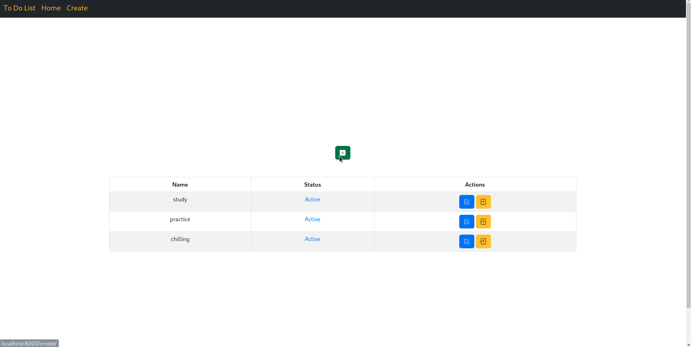

# Getting Started with Create django CRUD APP

## Table of contents

- [Overview](#overview)
- [My process](#my-process)
    - [Built with](#built-with)
- [Author](#authors)


## Overview



## My process

1) Clone the project

   ``` https://github.com/MohamedEldefrawy/Chat-Room-NodeJs.git```
2) ```docker-compose up```
3) Go to  [http://localhost:8000](http://localhost:8000) to view it in your browser.
4) Or pull image from [Docker Hub](https://hub.docker.com/r/modafro/todo-web-django) ```docker run -d modafro/todo-web-django -p 8000:8000 ```

### Built with
* [Django](https://www.djangoproject.com/download/)
* [bootstrap5](https://getbootstrap.com/)


## Authors

* LinkedIn - [Mohamed Eldefrawy](https://www.linkedin.com/in/mohamedeldefrawy)

<p align="right">(<a href="#top">back to top</a>)</p>

